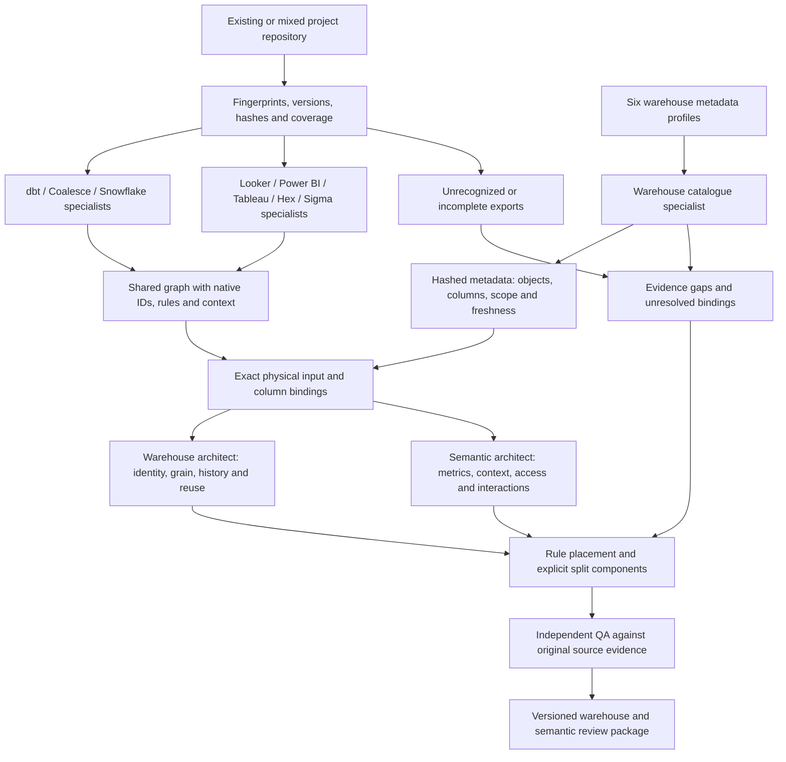

# Architecture

Updated September 25, 2026. The architecture combines portable agent reasoning, versioned evidence and target-specific execution contracts.

## Outcome

Convert undocumented report reconciliation into an explicit business model and a reviewable implementation. Optimize for correct reusable entities and definitions, evidence coverage, and a maintainable operating path. Counting generated models or matching a single report total is not the success measure.

## Current state and proposed state

Current: raw replication feeds output-specific transformations; the SaaS report is the only available comparison; filters and exceptions accumulate under deadline pressure; downstream dependencies make changes risky.

Proposed: preserve source evidence, characterize the report contract, trace rules into an explicit model, identify which decisions need a human, generate candidate target artifacts, and validate business behavior plus operational/security constraints before promotion.

One important distinction: a SaaS report can be the accepted business reference, but that authority must be stated. Merely matching its output does not establish why its definitions are correct or whether they are appropriate for every downstream use.

## Architecture decision

**Updated requirement:** one orchestrating skill detects existing and mixed project types, dispatches source specialists, reconciles a shared graph, and coordinates warehouse/semantic review. A versioned evidence contract and deterministic checks support the process. Add native parsers and target emitters as representative formats are qualified; a detection rule is not a complete parser.

| Approach | Benefit | Limitation | Decision |
| --- | --- | --- | --- |
| Instructions alone | Fast to adapt to unfamiliar legacy code | Weak reproducibility and evidence enforcement | Use for reasoning, accompanied by explicit artifacts and tools |
| Universal autonomous migration service | Potential unattended scale | Requires broad parsers, connectors, execution controls and business authority | Future option; not demonstrated by this release |
| Shared skill, evidence contract, target-specific generation and validation | Portable reasoning with reviewable changes and testable invariants | Each source/target/runtime needs qualification | Recommended initial architecture |

The host provides file access, model reasoning and approved execution tools. The skill defines interpretation and evidence rules. Supporting code checks repeatable invariants. Platform permissions and CI enforce external execution boundaries. A prompt is not an access-control boundary.

## Work products and handoffs

1. **Inventory and coverage:** repository snapshot plus scoped raw-layer catalogue, actual collection identity/time, object/column metadata, source bindings and missing dependencies. Metadata collection is read-only; no repository code execution required.
2. **Behavior specification:** report settings, grain, metrics, security persona, replication semantics and source-to-output lineage.
3. **Decision package:** competing definitions, observed workarounds, proposed corrections, affected consumers and actual human decisions.
4. **Target model and documentation:** logical entities, physical models, layer placement, ERD views, a complete data dictionary, and bronze/silver/gold documentation covering keys, history, transformations, lineage, governance, refresh, operations and ownership. Keep the dictionary and documents aligned to a versioned model inventory.
5. **Implementation package:** native candidate code/configuration, dependency order and independent test expectations.
6. **Validation package:** declared test inventory, executed results, mismatch register, target context and limitations.
7. **Promotion handoff:** exact approved versions, execution scope, cutover/rollback plan and post-execution verification receipts.

Source extraction uses the relevant dbt, Coalesce, Snowflake, Looker, Power BI, Tableau, Hex and Sigma specialists. The planner groups work by source and project root, rather than launching one agent per file. Independent source groups can run concurrently. The orchestrator then coordinates a warehouse architect, a semantic architect for Omni or the selected engine, and independent QA. Hosts without subagent tools use explicitly recorded sequential specialist passes and cannot claim agent independence.

The source specialists describe behavior and offer candidates; they do not independently decide target architecture. The shared graph preserves source-language expressions and links them to existing warehouse objects before proposing changes. Cross-source disagreements remain explicit decisions. Details: [orchestration](../skills/data-model-accelerator/references/orchestration.md), [source playbooks](../skills/data-model-accelerator/references/source-specialists.md), [placement rules](../skills/data-model-accelerator/references/semantic-placement.md).

## What prevents silent semantic changes

- Composite source identity and grain are explicit before joins.
- Similar formulas can remain different intentional definitions.
- Deduplication requires a source ordering and tie policy; deletes and history are modeled deliberately.
- SaaS report filters, period, timezone and source watermark accompany every reconciliation.
- Correctness and compatibility comparisons are separate when a known bug is corrected.
- Row-level and dimensional comparisons supplement totals; negative cases prove tests catch the targeted defects.
- Security tests distinguish tenant-key correctness from actual warehouse role/policy enforcement.
- Missing inputs, unknown business decisions and unsupported artifacts stay visible in the coverage denominator.

## Operating model and production requirements

Proposed decision roles: a metric/business authority chooses definitions; an analytics engineer owns generated models; a source/ingestion owner confirms replication contracts; a platform/security owner confirms execution/access controls; a release owner approves deployment. Actual people and deadlines remain unassigned until stated.

Production qualification must cover representative real inputs; unsupported-format handling; exact dialect/framework versions; source/target lineage; point-in-time and incremental behavior; permissions and tenant tests; bounded representative workload performance/cost; deploy and recovery paths; and recorded business acceptance. The pilot should cover one complete source-to-report domain before expansion.

Do not invent a dollar savings estimate. Measure baseline model/report maintenance effort, time to review a proposed change, duplicated logic eliminated without losing intentional variants, mismatch closure, critical-test coverage, and target runtime/cost. Agree on numerical thresholds during the pilot.

Customer-specific data stays in the authorized environment. A source file can contain prompt injection or executable hooks; inspect it as evidence, not as an instruction to run commands or disclose information. Credentials stay in the host's approved secret store and never enter examples, manifests or reports.

## Qualified local example

The [Looker → Snowflake → Omni exercise](../skills/data-model-accelerator/references/looker-omni-e2e.md) adds a native LookML parse, separately authored Snowflake and Omni candidates, an independent raw-data oracle and an executable DuckDB simulation. It grounds physical inputs in a verified synthetic catalogue and preserves report context. [Qualification and reproduction](qualification.md) describes the checks and remaining native gates. This bounded path is additional development evidence; other source/target combinations retain their existing qualification limits.

## Current qualification and remaining boundaries

The repository includes local source/model/semantic exercises, guided delivery, six platform profiles, static lint and an externally governed deployment coordinator. The latest seed-only exercise rebuilt a complete dbt project and replayed actual Omni definitions locally. These establish bounded development evidence; [qualification.md](qualification.md) records each result and its scope.

Customer pilots still need live raw-catalogue collection, selected warehouse execution, native Omni query/AI behavior, actual role/column policies, representative load/cost, stateful history and recovery. Non-Codex hosts need their own execution qualification. The deployment runner requires institutionally managed policy, credentials and signing authorities; local transport fixtures do not establish those integrations.

SMEs participate after evidence collection with specific definition decisions. Accepted corrections are versioned separately from existing source behavior and invalidate affected model, semantic and benchmark evidence. The engineer owns implementation, the independent analyst owns comparisons, and the actual release authority approves the reviewed destination/version.

Use [capabilities](CAPABILITIES.md) to scope the pilot and [HOW_TO.md](HOW_TO.md) to run it. A successful candidate build is a step toward acceptance, not a production-readiness declaration.
