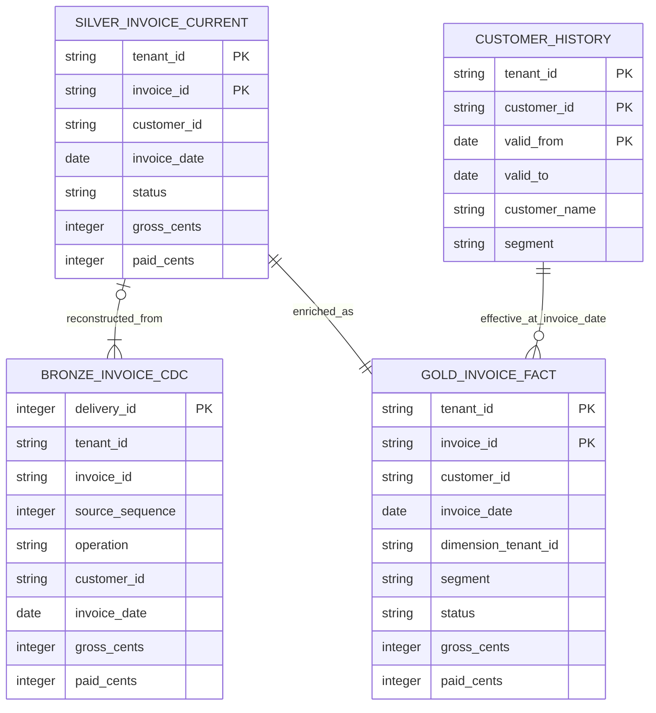

# Synthetic invoice model ERD

This is the bundled SQLite example, not an inferred customer model. Read the [report contract](../skills/data-model-accelerator/examples/report_contract.json) and [candidate SQL](../skills/data-model-accelerator/examples/candidate.sql) alongside it.

Keys on views express tested logical grain; they are not database-enforced constraints. Bronze has one row per delivery, including exact replays. A tenant/invoice can have several source versions and no current active row after a delete. The source contract rejects conflicting payloads at an identical tenant/invoice/source-sequence.

The current invoice view chooses the largest source sequence and then applies delete state. Customer-history enrichment requires tenant AND customer identity plus `invoice_date >= valid_from` and `invoice_date < valid_to`, with an open end when `valid_to` is null. The example expects exactly one matching history row for each current invoice; an overlap or missing match is a validation failure, not an instruction to discard the invoice.

Gold remains at one row per current tenant/invoice and keeps status. The report projection selects posted invoices and applies tenant/month/segment/invoice filters. Customer names and segments are denormalized attributes; the temporal join is a transformation relationship, not a simple customer-ID foreign key to a unique current dimension.

Payment rate is recomputed from summed paid and gross amounts after filtering. It is not calculated by summing or averaging invoice rates. The fixture uses integer USD cents and date-only UTC business dates; real currencies, precision, timestamps and timezones require target-specific contracts and tests.

The tenant predicates in this example test functional separation. They do not implement or prove warehouse role-based access control.
