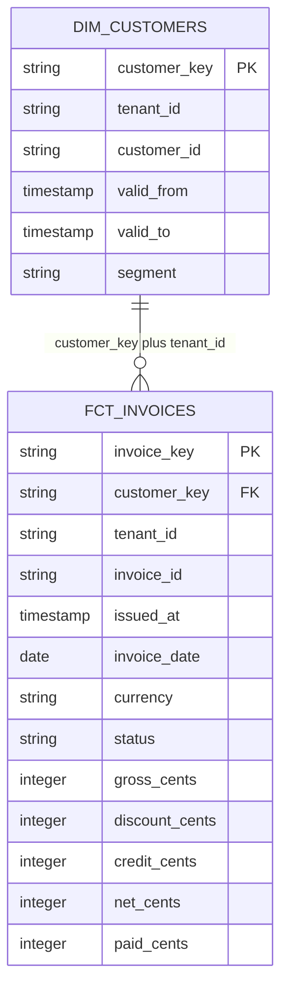

# Synthetic invoice model

This is the gold detail view. The [complete layer ERDs](../skills/data-model-accelerator/examples/looker-omni-e2e/documentation/model-erd.md), [data dictionary](../skills/data-model-accelerator/examples/looker-omni-e2e/documentation/data-dictionary.md) and layer documents describe the full bronze-to-gold model.

Model contract: `skills/data-model-accelerator/examples/looker-omni-e2e/test-plan.json`. Candidate SQL and semantic definitions are hashed in the final run evidence. This diagram depicts the current full-rebuild candidate, not deployed objects.

All physical objects are in `DMA_SIM.GOLD`. Fact grain is tenant+invoice. Dimension grain is tenant+customer+effective-start, plus a tenant-specific Unknown row. The invoice event timestamp selects a start-inclusive/end-exclusive historical customer version upstream. A tested key join in Omni uses that version; it does not substitute current customer attributes. Keys shown here are assertions to validate, not evidence of enforced Snowflake constraints.

Four source-specific bronze inputs feed four typed silver models. Payments and credits aggregate separately to tenant+invoice+currency before entering the fact. All statuses, currencies and periods remain in the warehouse; report filters, sums and ratios stay downstream. See [the complete layer and validation contract](../skills/data-model-accelerator/references/looker-omni-e2e.md).
