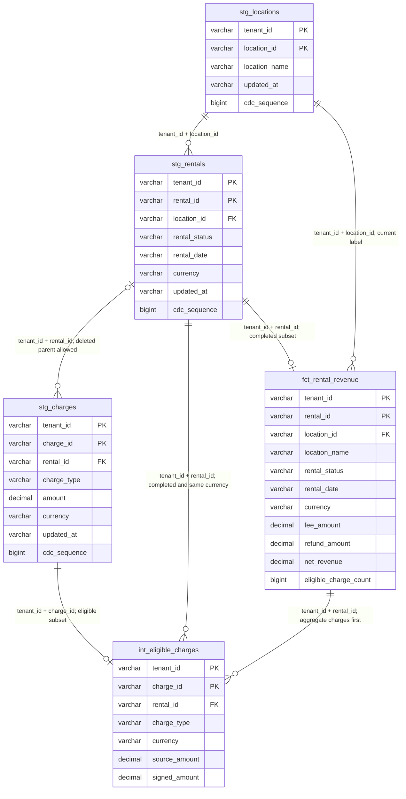

# Rental model relationships and lineage

Authority: **synthetic** `SYNTHETIC-RENTAL-DECISION-001`. This documents the local trial, not a live warehouse or Omni deployment. Keys shown below are composite; no bare entity ID is globally unique. All fields are non-null in the supplied fixture; the complete eight-relation column inventory is in [the dictionary](data-dictionary.md).

The arrows above express logical relationships, not enforced database foreign keys. In particular, `tenant_id` participates in every marked foreign key even where Mermaid displays the entity ID separately. All `decimal` fields are `DECIMAL(18,2)`.

| Immutable source | Current-state staging | Further dependency |
|---|---|---|
| `ref('raw_rentals')` | `stg_rentals` | `int_eligible_charges`, `fct_rental_revenue` |
| `ref('raw_charges')` | `stg_charges` | `int_eligible_charges` → `fct_rental_revenue` |
| `ref('raw_locations')` | `stg_locations` | `fct_rental_revenue` |

Each raw relation retains replicated CDC events. Staging ranks by descending sequence and timestamp before filtering tombstones. The snapshot watermark is `2026-08-16T00:00:00Z`; current location labels replace older labels even for older rental dates. No SCD/as-of history is implied.

The gold-to-charge relationship describes the analytical grain, not a reverse dbt dependency: the fact depends on intermediate charges aggregated by the composite rental key. Completed rentals may have zero eligible charges and still appear once in gold.

Recover by restoring catalogue-verified raw CSVs and rebuilding all five tables, then rerunning schema, grain and tenant checks. Composite joins do not enforce tenant authentication or RLS; see [the Omni contract](../semantic/omni-contract.md).
