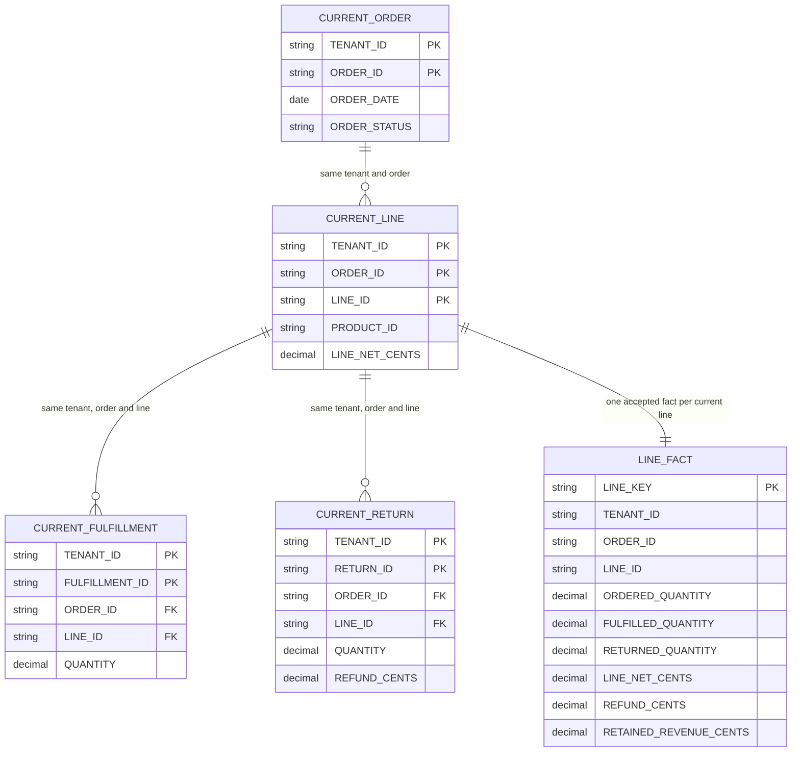
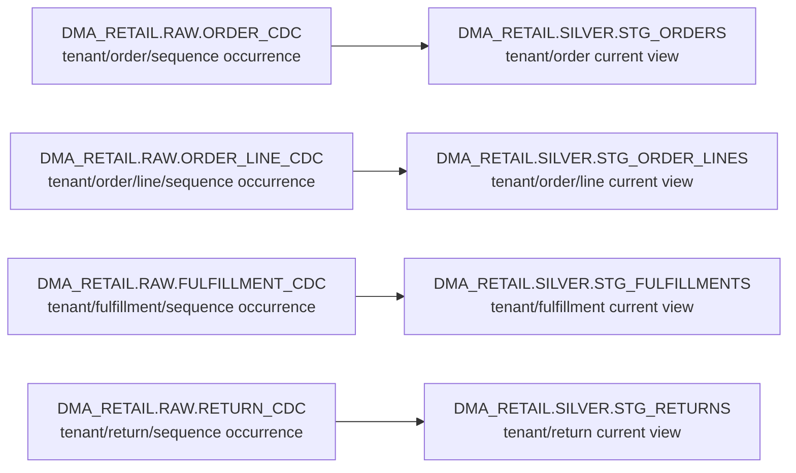
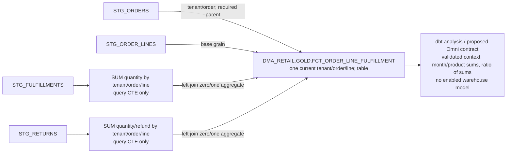

# Retail model ERD

The physical warehouse denominator is nine objects and 68 columns: four reused raw contracts, four current silver views and one gold fact. The report is downstream and has no warehouse relation. All names below use local validation identities; the Snowflake profile example intentionally changes the target database/schema prefix. [Inventory](model-inventory.json) and [dictionary](data-dictionary.md) enumerate all columns.

## Logical relationships after validation

PK/FK marks denote tested logical key membership, not emitted or enforced database constraints. An order may have no current lines; a current line requires exactly one current order. A line may have zero/many fulfillment and return events; every current event requires one current line. Events are independently identified by tenant/event ID, not by line identity. The full composite reference is tenant/order/line even when an ERD column marker abbreviates it. None of these relationships is inferred from an ingestion arrow.

## Bronze to silver physical transformations

These arrows are source-to-target transformations. Complete captures permit identical repeated occurrences; ambiguous payload ties reject before latest-record normalization. Each view ranks SEQUENCE within its entity key and excludes the winning tombstone afterward. Current-only history has no effective time bounds; date cast and renamed status come from the current order, while discount arithmetic is preserved in current line staging.

## Gold and downstream query

The aggregation CTEs are not extra physical objects. Both joins require equality of TENANT_ID, ORDER_ID and LINE_ID. Missing aggregates default to zero; no parent row is dropped to conceal an orphan. LINE_KEY is tenant|order|line, with alphanumeric inputs making the delimiter safe. Gold retains all current statuses and tenants. Report date/status/product predicates and principal checks occur downstream; no all-time aggregate replaces interactive report semantics.
