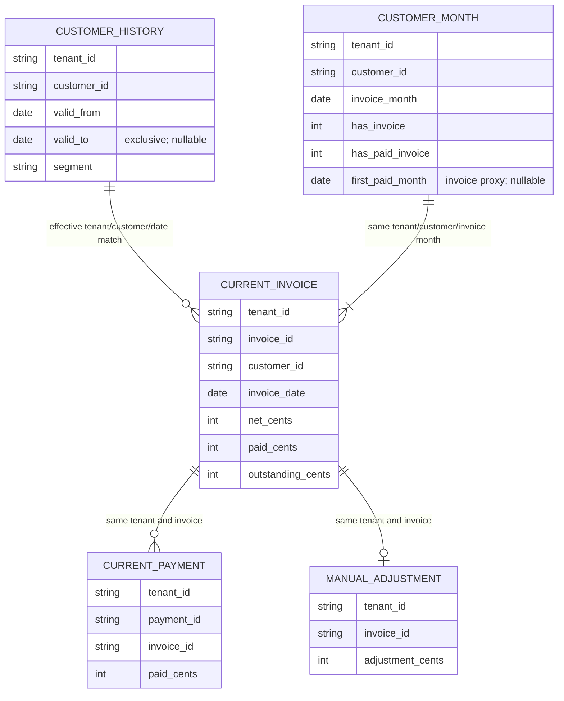
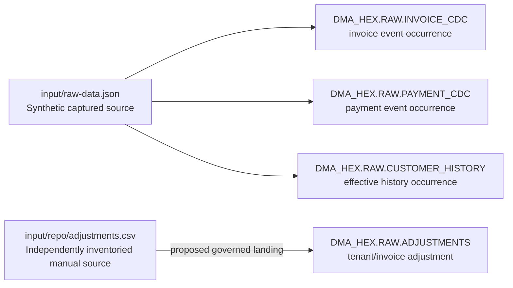
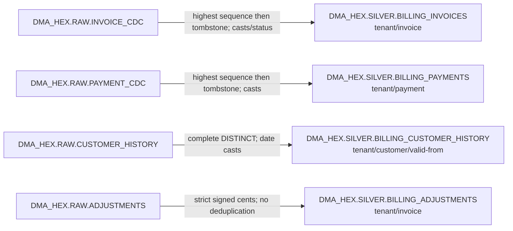
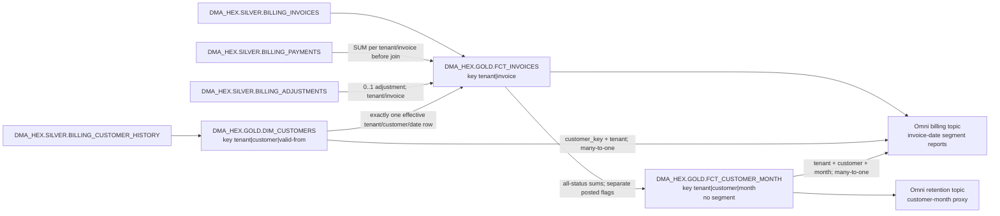

# Hex billing model: conceptual, logical and physical views

This editable diagram set covers all **11 models and 74 columns** through the linked [inventory](model-inventory.json) and [dictionary](data-dictionary.md). Relationship lines below describe proposed logical associations and transformation dependencies; they are not enforced foreign keys. Candidate DDL/CTAS emits no physical PK/FK/NOT NULL constraints. Data-test execution and native acceptance are separate evidence.

## Conceptual and logical grain

The billing domain contains versioned invoices and payments, effective customer classifications, and manual signed invoice corrections. A current invoice combines independently aggregated payments and at most one correction, then acquires exactly one historical customer classification at its invoice date. Monthly customer balances derive from those invoice facts. Repeated source occurrences are not additional business entities.

The effective join is `invoice.TENANT_ID = history.TENANT_ID AND invoice.CUSTOMER_ID = history.CUSTOMER_ID AND invoice.INVOICE_DATE >= history.VALID_FROM AND (invoice.INVOICE_DATE < history.VALID_TO OR history.VALID_TO IS NULL)`. An unmatched or multiply matched invoice fails validation. No current-segment or Unknown-member fallback is asserted. A customer-month contains at least one current invoice; a dense month spine is outside scope.

## Bronze responsibility / physical source view

Arrows denote a source/landing mapping, not a demonstrated connector or physical constraint. Invoice/payment version identity adds `SEQUENCE` to the tenant/business key. Exact CDC/history replays remain visible in raw; adjustment duplicates always fail. The four RAW objects fulfill bronze duties without an extra copied layer.

## Silver physical transformation view

Source conflicts, invalid identities, duplicate adjustments and overlapping histories must fail before these current-state results are promoted. Every source-to-target column is listed in the dictionary. No status/date/tenant report filter is applied upstream.

## Gold physical relationship and aggregation view

The Omni relationship from invoices to customer-month is a many-to-one lookup for cohort proxy fields, not a reverse aggregation join. Segment stays on invoice history. `HAS_INVOICE` and `HAS_PAID_INVOICE` are intentionally different; the diagrams do not imply one approved definition of active customer. Cohorts use current paid balances at the captured watermark and do not establish payment-event-time retention.
