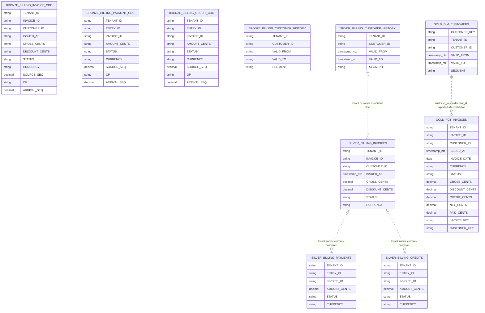

# Model ERD and build flow — all ten models

All physical objects are in `DMA_SIM`. [Inventory](model-inventory.json) contains exact uppercase identities and column order; [dictionary](data-dictionary.md) defines types, logical nulls, keys, transformations and tests. This diagram is a candidate logical model, not a deployed constraint inventory.

## Entity relationships

The four bronze entities are deliberately shown without relationship edges. They hold change/history occurrences with possible replay duplicates, and no native PK/FK relationships were supplied. Isolated diagram nodes mean relationships are unverified, not that the sources are unrelated.

Silver associations below are logical candidates on tenant-qualified business IDs. Ledger-to-invoice orphan policy and currency agreement must be validated. The customer-history association is temporal and may match zero or one interval only after overlap validation. The gold relationship expects exactly one matched or Unknown dimension member per invoice. None of these edges declares or proves enforced Snowflake PK/FK constraints.

SQL type labels here are abbreviated for readability. Bronze timestamps and monetary values are strings; downstream timestamp/number metadata is inferred from SQL rather than inspected natively. The dimension Unknown row permits null customer ID and validity endpoints. The dictionary carries the full distinctions.

## Build lineage and transport boundary

These arrows describe dependencies and transformations, not foreign keys. The input arrows represent local fixture loading; no real SaaS replication connector, freshness SLA or ingestion service is implemented by this case. Schemas are created by the bootstrap, then silver/gold tables are rebuilt in dependency order.

```mermaid
flowchart LR
  SRC["Synthetic raw-data.json arrays; real replication unknown"]
  subgraph bronze["DMA_SIM.BRONZE"]
    BRONZE_BILLING_INVOICE_CDC["BILLING_INVOICE_CDC"]
    BRONZE_BILLING_PAYMENT_CDC["BILLING_PAYMENT_CDC"]
    BRONZE_BILLING_CREDIT_CDC["BILLING_CREDIT_CDC"]
    BRONZE_BILLING_CUSTOMER_HISTORY["BILLING_CUSTOMER_HISTORY"]
  end
  subgraph silver["DMA_SIM.SILVER"]
    SILVER_BILLING_INVOICES["BILLING_INVOICES"]
    SILVER_BILLING_PAYMENTS["BILLING_PAYMENTS"]
    SILVER_BILLING_CREDITS["BILLING_CREDITS"]
    SILVER_BILLING_CUSTOMER_HISTORY["BILLING_CUSTOMER_HISTORY"]
  end
  subgraph gold["DMA_SIM.GOLD"]
    GOLD_DIM_CUSTOMERS["DIM_CUSTOMERS"]
    GOLD_FCT_INVOICES["FCT_INVOICES"]
  end
  OMNI["Omni candidate views, relationship and billing topic"]
  REPORT["Preserved report context; local simulation interface"]
  SRC -->|fixture load only| BRONZE_BILLING_INVOICE_CDC
  BRONZE_BILLING_INVOICE_CDC -->|latest source version then delete filter and casts| SILVER_BILLING_INVOICES
  SRC -->|fixture load only| BRONZE_BILLING_PAYMENT_CDC
  BRONZE_BILLING_PAYMENT_CDC -->|latest source version then delete filter and casts| SILVER_BILLING_PAYMENTS
  SRC -->|fixture load only| BRONZE_BILLING_CREDIT_CDC
  BRONZE_BILLING_CREDIT_CDC -->|latest source version then delete filter and casts| SILVER_BILLING_CREDITS
  SRC -->|fixture load only| BRONZE_BILLING_CUSTOMER_HISTORY
  BRONZE_BILLING_CUSTOMER_HISTORY -->|typed distinct intervals| SILVER_BILLING_CUSTOMER_HISTORY
  SILVER_BILLING_CUSTOMER_HISTORY -->|history versions| GOLD_DIM_CUSTOMERS
  SILVER_BILLING_INVOICES -->|tenant Unknown members| GOLD_DIM_CUSTOMERS
  SILVER_BILLING_INVOICES -->|all current invoice rows| GOLD_FCT_INVOICES
  SILVER_BILLING_PAYMENTS -->|posted totals by tenant invoice currency| GOLD_FCT_INVOICES
  SILVER_BILLING_CREDITS -->|posted totals by tenant invoice currency| GOLD_FCT_INVOICES
  GOLD_DIM_CUSTOMERS -->|as-of historical key or Unknown fallback| GOLD_FCT_INVOICES
  GOLD_DIM_CUSTOMERS -->|historical segment via key| OMNI
  GOLD_FCT_INVOICES -->|invoice-grain fields| OMNI
  OMNI -->|posted sums ratio and tenant filter| REPORT
```

## Identity and cardinality conditions

- Bronze entity/version tuples may repeat because exact replay is allowed; do not join raw occurrences as if they were unique current records.
- Silver invoice identity is `(TENANT_ID, INVOICE_ID)`; payment/credit identities are separately `(TENANT_ID, ENTRY_ID)`. Aggregate each ledger to tenant/invoice/currency before combining them.
- History identity is `(TENANT_ID, CUSTOMER_ID, VALID_FROM)` with half-open intervals. `SELECT DISTINCT` removes exact duplicate rows but does not prove non-overlap or resolve conflicts.
- Gold `INVOICE_KEY` and dimension `CUSTOMER_KEY` are logical surrogate keys marked in Omni. The Omni relationship matches both `CUSTOMER_KEY` and `TENANT_ID`; key coverage must resolve to a dimension row within the same tenant. Candidate SQL declares no warehouse primary or foreign keys. Keys need non-nullness, uniqueness, collision and referential checks.
- MD5 encoding relies on alphanumeric delimiter-free IDs and whole-second history starts. Unknown member uses a reserved tenant-scoped sentinel; it is not one global member shared across tenants.
- The fact stores the as-of key once. Omni joins by that key and must not add another unconstrained customer-ID or temporal join.

## Operational and validation limits

No real replication, owner, refresh schedule, incremental state, atomic publication, row policy, grants or live tenant configuration was verified. Bronze uses IF NOT EXISTS; silver/gold use full CREATE OR REPLACE. These diagrams document candidates, not authorization to run them. Physical nullability, CTAS type details, performance and native engines remain unverified. Logical source-contract validation, independent row/aggregate comparisons, temporal/fanout tests and negative personas are required before acceptance.

The diagram text was checked for inventory coverage; it was not validated by a native warehouse or BI engine, and no rendered-diagram fidelity claim is made.
