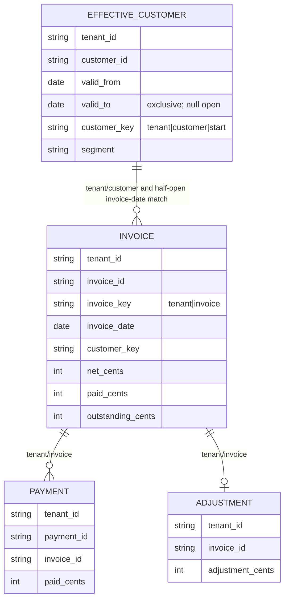
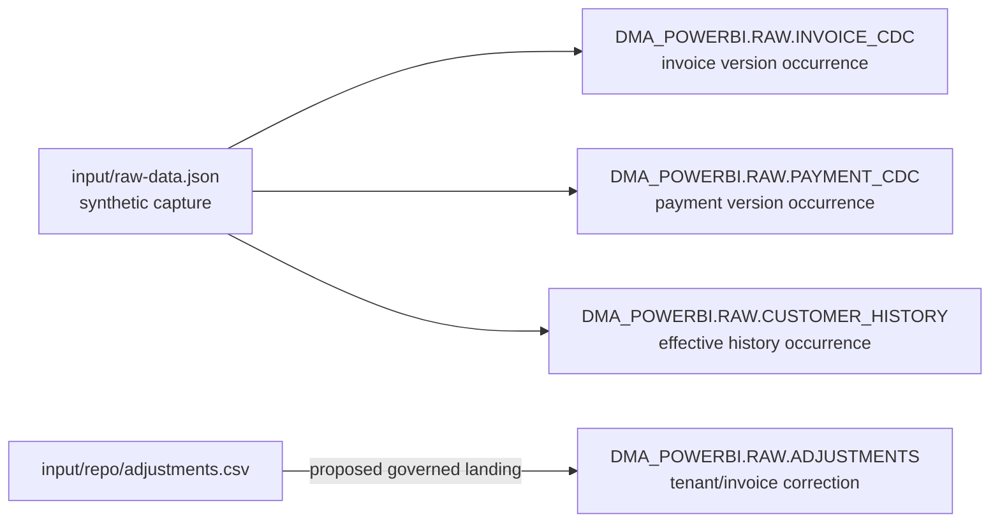
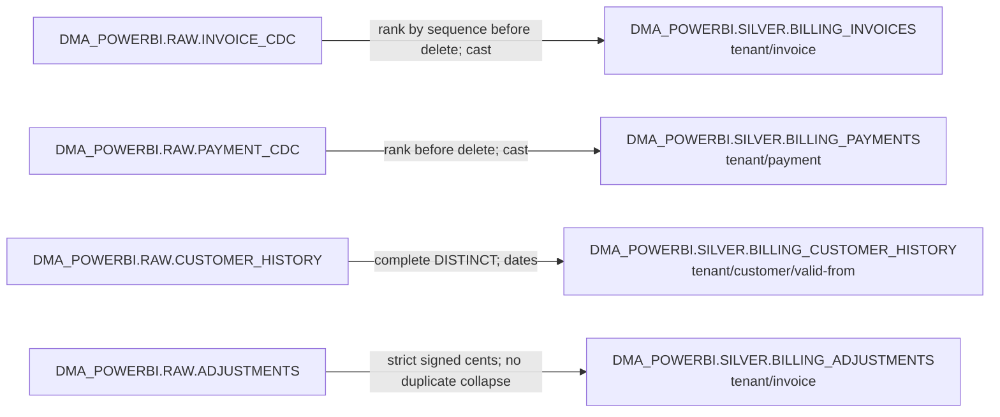
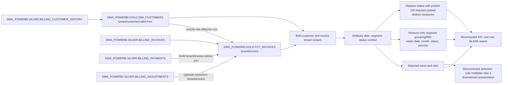

# Power BI billing model ERD

The inventory covers **10 physical models and 64 columns**. These editable diagrams show proposed transformations and logical relationships. No arrow asserts enforced foreign keys, native RLS or a demonstrated source loader. [Dictionary](data-dictionary.md) and [inventory](model-inventory.json) are the complete column denominator.

## Logical identities and cardinality

An invoice requires exactly one same-tenant effective customer: `invoice_date >= valid_from AND (invoice_date < valid_to OR valid_to IS NULL)`. No match or overlapping matches fail rather than producing Unknown or fanout. Payment and adjustment references must target a current invoice; an invoice may have zero payments or no adjustment. Fixture key components exclude pipes. Natural identities are tenant/invoice, tenant/payment and tenant/customer/valid-from; surrogate strings are convenience encodings, not production collision guarantees.

## Bronze objects

RAW dates are VARCHAR; number precision follows the candidate DDL. CDC/history exact replays may repeat at this boundary. Adjustment duplicate keys are invalid. Ingestion arrows are declarations, not connector evidence.

## Silver objects

Same-version conflicts are rejected before ranking. Report filters, DAX context modifiers and disconnected Scenario selections do not change these current-state grains.

## Gold and downstream query boundaries

Only the two gold table boxes are warehouse models. The source Scenario table is disconnected; it contributes no warehouse join. Source Customers Segment propagates through the active many-to-one effective key; target report dimensions likewise use customers.segment. KPI totals independently evaluate altered measure contexts even when selected rows are empty. Native Omni join/subquery/BLANK behavior and actual security enforcement remain unverified.
