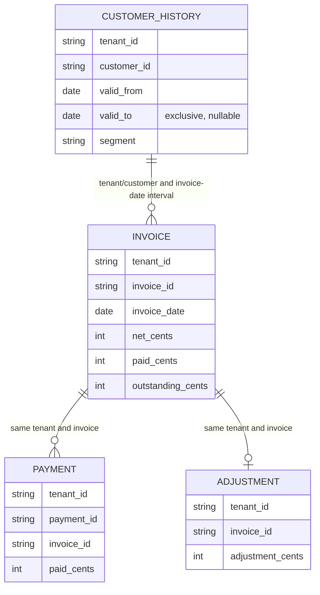
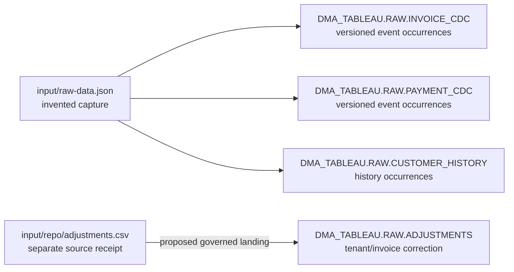
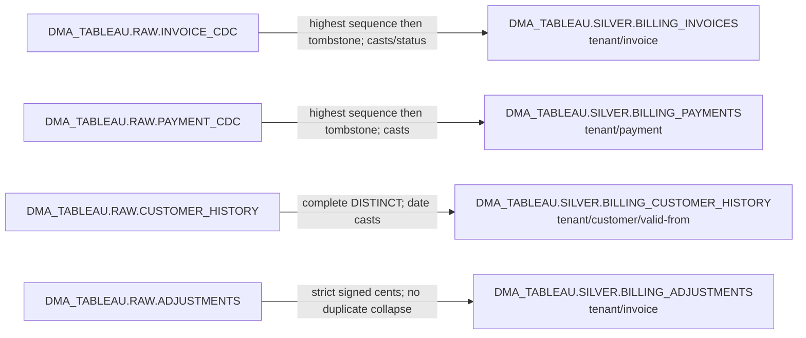
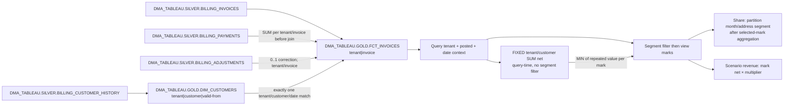

# Tableau billing model: conceptual and physical layer views

These editable diagrams cover all **10 physical models**. The [inventory](model-inventory.json) and [dictionary](data-dictionary.md) enumerate all **64 columns**. Arrows represent proposed logical relationships or transformations, never proof of physically enforced keys or production ingestion. Candidate DDL and CTAS emit no enforced PK/FK/NOT NULL constraints.

## Conceptual and logical model

Current invoice identity is tenant/invoice; current payment identity is tenant/payment. Every current payment/adjustment must reference a current invoice in the same tenant. An invoice requires exactly one historical customer match at `invoice_date >= valid_from AND (invoice_date < valid_to OR valid_to IS NULL)` within the same tenant/customer. A missing or overlapping match fails rather than introducing an Unknown member.

## Bronze physical responsibilities

The arrows are a source contract, not a demonstrated connector. RAW implements bronze without another copied layer. Dates are physically VARCHAR at the declared raw boundary. CDC/history allow exact replay; adjustment duplicate keys are errors.

## Silver physical transformations

Source conflicts, missing keys, invalid dates and overlap fail before model promotion. Current source grain remains independent of worksheet filters, FIXED scope, share partition and multiplier.

## Gold physical and query-time dependencies

Only DIM_CUSTOMERS and FCT_INVOICES are gold physical tables. The query-time boxes deliberately are not warehouse models. The customer FIXED calculation retains context and does not become an all-time materialized total. Share and scenario multiplier are presentation behavior. Segment-sensitive customer value, grand totals, limits, densification, actions and native rendering require separate qualification.
