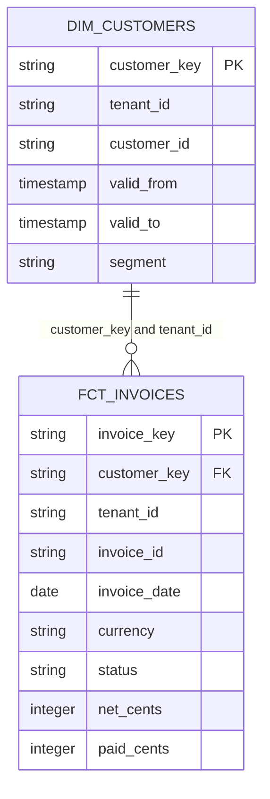

# Looker → Snowflake medallion → Omni: executable synthetic exercise

This example runs a complete local migration test using invented data. It parses original LookML and the emitted Omni files, executes generated Snowflake SQL through a bounded DuckDB adapter, and compares outputs with an independently authored oracle. It does not run Looker, Snowflake or Omni services, regenerate the migration with an LLM on every replay, or establish deployment approval.

## Run it

Use Python 3.12 in a dedicated environment and install `scripts/requirements-e2e.txt`. From the skill directory:

```sh
python scripts/run_looker_omni_e2e.py --output /absolute/new-output-directory
```

The default input is `examples/looker-omni-e2e`. Output must be new or empty and outside the case. `--case /absolute/case` supports a reviewed copy of this exact fixture contract, not arbitrary customer SQL. Source names, permitted namespaces, file formats and SQL constructs are deliberately bounded. Do not weaken unsupported-construct checks to obtain a passing run.

The runner writes the source inventory and parsed CTE graph, synthetic catalogue and physical-input bindings, rendered source/target queries, row comparisons, gold rows, and `e2e-report.json`. The report distinguishes simulation success from unavailable native validation and human approval. The case's `test-plan.json` predeclares all required checks and pins the independent oracle, raw input and scenario; missing checks or changed expectations fail validation. A jointly edited test plan and oracle are still editable files, not an authenticity or approval mechanism.

## The representative mess

Four Looker project files contain an executive collections dashboard, model access filter, nine-CTE derived table, nine dimensions and five measures. Forty-eight raw records cover 17 invoice changes,18 payment changes,9 credit changes and 4 customer-history records. Tenant IDs repeat across business identifiers to expose unsafe joins. The case includes duplicate events, out-of-order arrivals, updates, deletes, reversed credits, multiple payments and credits per invoice, changing customer segments, unknown customers, drafts, USD/EUR, month-boundary timestamps, zero net amounts and an empty date range.

The source deliberately concentrates reusable transformations inside the derived table. A successful migration must preserve both its report context and the independently stated intended behavior. It cannot conclude that a matching total proves either business authority or safe joins.

## Where the logic moves

| Destination | Physical or semantic output | Responsibility |
|---|---|---|
| Bronze | Four `DMA_SIM.BRONZE.BILLING_*` sources | Preserve source change events and history snapshots, including original ordering and raw text amounts. The loader is synthetic; no replication service is deployed. |
| Silver | `BILLING_INVOICES`, `BILLING_PAYMENTS`, `BILLING_CREDITS`, `BILLING_CUSTOMER_HISTORY` | Select source versions before applying tombstones; normalize types/statuses; collapse exact history snapshot repeats. Reject conflicting CDC payloads, invalid money and overlapping distinct histories in preflight. |
| Gold | `FCT_INVOICES`, `DIM_CUSTOMERS` | Separately aggregate posted payments/credits to tenant+invoice+currency; calculate reusable invoice amounts once; bind the historical customer version or tenant Unknown member. |
| Omni | `invoices.view`, `customers.view`, `relationships`, `billing.topic` | Filtered sums/counts, ratio of sums, labels/formatting, many-to-one exploration join and declared tenant access filter. |
| Report context | Companion `report-context.json` | Date/currency controls and defaults, selected fields, posted tile filter, listens, sorting and limit. This JSON is a local interface, not a native Omni dashboard artifact. |

The shared fact retains drafts, EUR and out-of-period rows. September/USD/posted dashboard defaults do not become warehouse-wide exclusions. The exact source-rule crosswalk is in `target/semantic-assessment.md`. Apply [naming-and-modeling.md](naming-and-modeling.md) and [looker-omni-contract.md](looker-omni-contract.md) to both architectural passes.

## Model documentation

The case includes [a full dictionary](../examples/looker-omni-e2e/documentation/data-dictionary.md), [bronze](../examples/looker-omni-e2e/documentation/bronze.md), [silver](../examples/looker-omni-e2e/documentation/silver.md), [gold](../examples/looker-omni-e2e/documentation/gold.md) documentation and [ERD layer views](../examples/looker-omni-e2e/documentation/model-erd.md). Its JSON inventory and dictionary support explicit model/column coverage checks; the review manifest binds them to the candidate and evidence. Follow the [required deliverable contract](model-documentation.md) when creating a new model.

## Model and grain



Fact grain is one current invoice per tenant+invoice. Dimension grain is tenant+customer+effective-start, plus one Unknown member per tenant. Gold contains 12 invoices and 6 dimension rows in the unchanged fixture. Source event time selects a half-open customer-history interval upstream; Omni uses the resulting key and tenant, without applying a second temporal join. PK/FK annotations state tested intent, not Snowflake constraint enforcement.

Money remains integer cents and currencies remain separate. The report rate is aggregate paid cents divided by aggregate net cents, with an undefined result at zero denominator. `issued_at` represents UTC by explicit input contract; `invoice_date` is its America/Chicago date. This case tests month-boundary midnight behavior; daylight-saving-transition and subsecond history cases still need separate qualification.

## Independent evidence and checks

The oracle specialist saw only raw JSON and the written scenario before freezing 12 expected invoice rows and 9 report scenarios/17 result rows. It used Python integer/Decimal arithmetic and independent fraction controls. The semantic compiler specialist received the source and emitted semantic formats without the expected outputs. QA later inspected the complete candidate and probed failure modes. These are separate agent responsibilities, not human sign-off.

The executable suite compares baseline source-derived rows and target gold rows to the independent oracle, then compiles both source LookML and actual target Omni measures for totals, historical segment, daily results, selected segment, alternate currency, another tenant, prior month, zero-net and empty intervals. Integer amounts/counts match exactly; only fractional rates permit absolute tolerance 1e-12. Additional checks cover natural/surrogate grain, dimension coverage, fanout, tenant and history joins, non-report populations, dashboard context/defaults, measure filters without the dashboard, invalid personas, replay and arrival order.

Deliberately wrong candidates must fail: missing tenant or temporal joins, double-subtracted credits, arrival-based CDC selection, premature delete filtering, sum of row ratios, lost measure filters, omitted access filters, quoted lowercase Snowflake columns, omitted catalogue columns, changed connection identity, altered dashboard defaults and missing selected measures. Invalid-source controls cover conflicting versions, currency mismatch, overlapping history and nonnumeric money. Parser exceptions unrelated to the intended mutation do not count as successful business-error detection.

## Corrections exposed by testing

- Full fixture replay initially expanded 12 projected invoice rows to 45 because raw history was copied repeatedly. Silver now deduplicates complete identical history records; distinct overlaps remain invalid. This is a narrowly justified replay correction, not arbitrary DISTINCT on the fact. The frozen oracle's own replay control covered CDC streams; the full-snapshot replay check is additional acceptance evidence. Original Looker history SQL is preserved and is not claimed to share this correction.
- An empty half-open interval initially failed the compiler. It now returns an empty population while reversed intervals still fail. Native Looker empty-total rendering is unverified: offline source sums return NULL, while the proposed Omni wrappers explicitly return zero totals under the scenario contract.
- Explicit scenario parameters masked changed dashboard defaults. Structural context checks and queries without date/currency overrides now cover the defaults, with negative controls for changed dates/currency and a removed measure.
- QA found external file reads and omitted warehouse-connection binding in the local adapter. SQL scope/function guards, disabled external access and explicit fixture connection mapping now have regression coverage. This reduces the fixed simulator's execution surface; it is not a security sandbox for untrusted repositories.
- Strict transpilation exposed a timestamp-format mismatch. The adapter supports one explicit Snowflake `TO_CHAR` mask using an equivalent local format; other masks fail. Quoted physical identifier case is checked separately because DuckDB could conceal Snowflake case errors.

The fixed USD label on an unused source display measure is separately proposed for correction. No native dashboard formatting or visual parity has been demonstrated.

## Development and promotion runbook

1. For a real pilot, select one source repository/domain and obtain a scoped, dated raw catalogue with connection/account identity, export hashes, visibility gaps, replication semantics and sanitized reconciliation evidence. Synthetic metadata must never stand in for a live export.
2. Parse that repository with appropriate specialists, resolve physical and column bindings, confirm grain/identity/history/currency/security rules, and obtain decisions for intended corrections. Preserve existing working layers and names where appropriate.
3. Generate a fresh warehouse/semantic candidate tied to those inputs. The sample SQL uses `CREATE OR REPLACE TABLE` full rebuilds. Before authorized development execution, remap every namespace to an isolated development database and review overwrite effects. Do not run these files wholesale against an existing production database.
4. Run native Snowflake compilation/execution and target data tests; choose real materializations, incremental strategy, late/deleted-record handling, refresh SLAs, resource limits and ownership. Fixture replay proves neither incremental MERGE correctness nor performance at scale. Source preflight checks must become operational warehouse/framework tests before deployment.
5. Validate the four native Omni model files in a development model with documented APIs; do not import companion report JSON as YAML. Verify actual topic queries, roles/attributes, positive and denied personas, model metadata and reporting behavior. Raw SQL tab results do not prove semantic-layer security.
6. Reconcile aligned source/target snapshots and obtain human approval for the exact model, ERD, code, tests, access policies and intentional differences. Keep current reports available during a shadow comparison. Only then prepare a separately authorized cutover.
7. Define rollback using existing approved model revisions and retained prior warehouse objects; verify that retention and access allow restoration. The simulator contains no deployed rollback automation or assumed zero-copy clone. Retire source transformations only after dependency and acceptance evidence is complete.

Assessment, candidate generation and local validation are distinct from native target validation, human approval and verified deployment. Native ingestion, production schedules, cost/performance, SSO/user attributes, live SaaS reconciliation, generalized parser coverage and native dashboard creation remain outside this exercise.
